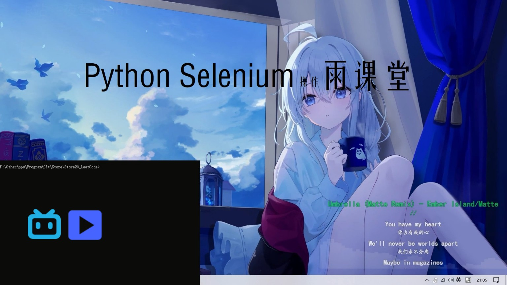
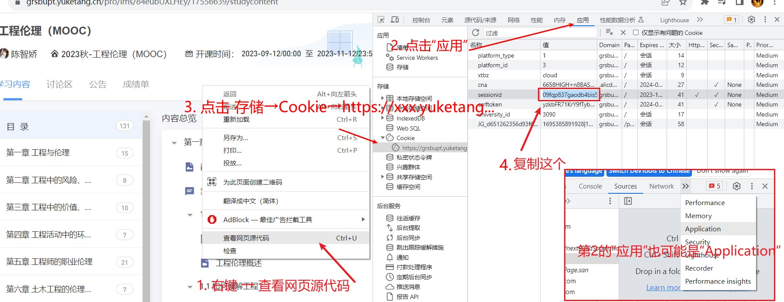

<!--
 * @Author: LetMeFly
 * @Date: 2023-09-22 18:26:15
 * @LastEditors: LetMeFly
 * @LastEditTime: 2023-12-22 23:38:00
-->
# YuketangAutoPlayer

雨课堂刷课脚本（雨课堂视频自动播放），基于浏览器模拟的方式运行，无需虚拟机，甚至可以以无窗口模式运行。（MOOC）

视频演示地址：[Bilibili@BV15K4y1F7EN](https://www.bilibili.com/video/BV15K4y1F7EN/)

<!-- <iframe src="//player.bilibili.com/player.html?aid=873783562&bvid=BV15K4y1F7EN&cid=1275745338&p=1" scrolling="no" border="0" frameborder="no" framespacing="0" allowfullscreen="true"> </iframe> -->

[](https://www.bilibili.com/video/BV15K4y1F7EN/)

## 使用方法

主要分为四步：

1. 配置Python环境
2. 配置浏览器驱动（推荐Chrome浏览器）
3. 设置刷课信息
4. 开始刷课

### 一、配置Python环境

记得安装好```selenium```

```bash
pip install selenium
```

### 二、配置浏览器驱动

本项目默认以Chrome为例，以Windows系统为例。其他浏览器原理类似、其他操作系统原理类似。

首先电脑上要安装有[Chrome浏览器](https://www.google.cn/chrome/index.html)（别装到假的Chrome了，之前有同学装了个假Chrome后来问我为什么程序不能正常运行QAQ）

其次需要下载**对应版本的**```ChromeDriver```：[下载地址1](https://chromedriver.chromium.org/downloads)、[下载地址2](https://googlechromelabs.github.io/chrome-for-testing/)、[下载地址3](https://github.com/LetMeFly666/YuketangAutoPlayer/releases/download/v0.0/chromedriver.exe)、[教程1](https://blog.csdn.net/fighting_jiang/article/details/116298853)、[教程2](https://blog.csdn.net/zhoukeguai/article/details/113247342)、[最后的尝试](https://cn.bing.com/search?q=chromedriver%E4%B8%8B%E8%BD%BD)。（版本相差不大的话也无所谓）

将```ChromeDriver.exe```放到```环境变量```中 或 ```脚本(执行)目录```下。

### 三、设置刷课信息

打开```main.py```，代码头部存在以下信息，需要你自己修改：

```python
IF_HEADLESS = False  # 是否以无窗口模式运行（首次运行建议使用有窗口模式以观察是否符合预期）
COURSE_URL = 'https://grsbupt.yuketang.cn/pro/lms/84eubUXLHEy/17556639/studycontent'  # 要刷的课的地址（获取方式见README）
COOKIE = 'sjfeij2983uyfh84y7498uf98ys8f8u9'  # 打死也不要告诉别人哦（获取方式见README）
```

#### ①IF_HEADLESS

是否以无窗口模式运行。建议以有窗口模式运行（那就不用改这一行了）。

若以无窗口模式运行，则不会弹出Chrome浏览器界面，但视频仍能正常刷取。

#### ②COURSE_URL

你要刷的课的URL。

进入雨课堂，进入你想要刷的课程，点击“学习内容”，复制地址栏的url即可。


（注意是https格式的哦）

#### ③COOKIE

**若你觉得COOKIE的获取比较麻烦，你可以选择[跳过这一步](#四开始刷课)并每次重新扫码登录。**扫码登录不支持HEADLESS模式。

COOKIE用来告诉雨课堂你是你。获取方式如下：

登录（你们学校的）雨课堂，```打开开发者工具```（下图的步骤1，也可百度），依次点击“应用→存储→Cookie→ https&#58;&#47;&#47;xxx.yuketang... ”，复制**sessionid**对应的值



————————————————————————————————————————————————————————————————————————————————————————————————————————————————————————————————————————————————————————————————————————————————————————————————————————————————————————————————————————————————————————————————————————————————————————————————————————————————————


### 三点五、Selenium/ChromeDriver 故障排除指南：解决网络请求失败问题
如果您的 Python/Selenium 脚本在尝试自动下载或定位 ChromeDriver 时遇到网络请求失败（Network Request Failed）的错误，通常是由网络限制或配置错误引起的。以下是两种推荐的解决方法。

步骤 1: 检查网络连接与代理设置
网络请求失败通常直接指向您的运行环境无法访问 Google 的 ChromeDriver 托管地址。

检查网络连接和防火墙：

确保您的计算机或网络没有被防火墙或安全软件阻止访问 Chrome for Testing 的配置地址：https://googlechromelabs.github.io/chrome-for-testing/known-good-versions-with-downloads.json。

网络问题可能是暂时性的，建议稍后重试运行脚本。

配置代理 (如果适用)：

如果您处于需要通过代理服务器才能访问外部网络的（例如公司或学校网络），可能需要配置系统或 Python/Selenium 的代理设置。

步骤 2: 手动下载并指定 ChromeDriver 路径 (最可靠的方法)
这是绕过自动下载网络问题的最可靠方法，它要求您显式地告诉 Selenium 驱动文件的确切位置。

1. 确定 Chrome 浏览器版本
打开您的 Chrome 浏览器。

点击右上角菜单（通常是三个点）→ 帮助 (Help) → 关于 Google Chrome (About Google Chrome)。

记下您的 Chrome 主版本号（例如：如果版本是 117.0.5938.150，主版本号即为 117）。

2. 下载对应的 ChromeDriver
访问 Chrome for Testing 官方网站：https://googlechromelabs.github.io/chrome-for-testing/。

在该页面中，找到与您 Chrome 主版本号匹配的 ChromeDriver 版本。

下载适用于您的操作系统（例如：Windows/win64）的压缩包。

解压后，您会得到一个名为 chromedriver.exe 的文件。

3. 修改代码指定路径
将 chromedriver.exe 放置在一个稳定的位置（例如项目的根目录或 D:\Drivers\chromedriver.exe）。

修改您的 Python 代码 (main.py)，显式地将驱动路径传递给 Service 对象。

————————————————————————————————————————————————————————————————————————————————————————————————————————————————————————————————————————————————————————————————————————————————————————————————————————————————————————————————————————————————————————————————————————————————————————————————————————————————————————————————————————————————————————————


### 四、开始刷课

```python
python main.py
```

## 使用提示

注意，使用过程中可以缩浏览器小窗口去干其他事情，但尽量不要将鼠标移动到程序弹出的浏览器窗口上。因为本项目的运行原理就是模拟用户对浏览器的控制。

**缓存**：若视频播放完毕程序正常结束，则缓存将被自动清理。若视频未播放完毕提前关掉了程序，则Windows系统下缓存位置在```%temp%/chrome_BITS_xxx```下。

## 感谢列表

+ 感谢[Github@SwordLikeRain](https://github.com/SwordLikeRain)的[Cookie错误时提示不准确的issue](https://github.com/LetMeFly666/YuketangAutoPlayer/issues/1)（good first issue），使得程序修改后支持了每次扫码登录。
+ 感谢[BiliBili@Bacch](https://space.bilibili.com/21043185)的```AttributeError: 'WebDriver' object has no attribute 'find_elements_by_class_name'```的[报错提醒](https://www.bilibili.com/video/BV15K4y1F7EN/#reply187204230304)，使得程序修改后兼容了selenium≥4.0。
+ 感谢[BiliBili@青鹧不懂蓝桉情](https://space.bilibili.com/1208020409)提供的账号，使得程序修改后支持了```www.yuketang.cn```这种域名下的雨课堂界面。

## 免责声明

本项目的唯一目的是：selenium技术的学习与实践。

禁止用于其他用途，下载后请于24h内删除【Doge】。

若导致账号封禁（目前来看完全不会）或其他因BUG造成的损失，与本项目无关。
